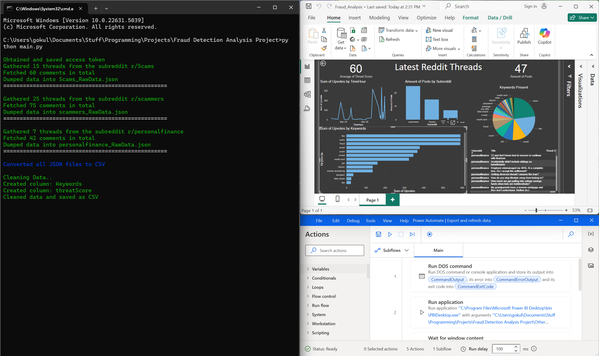
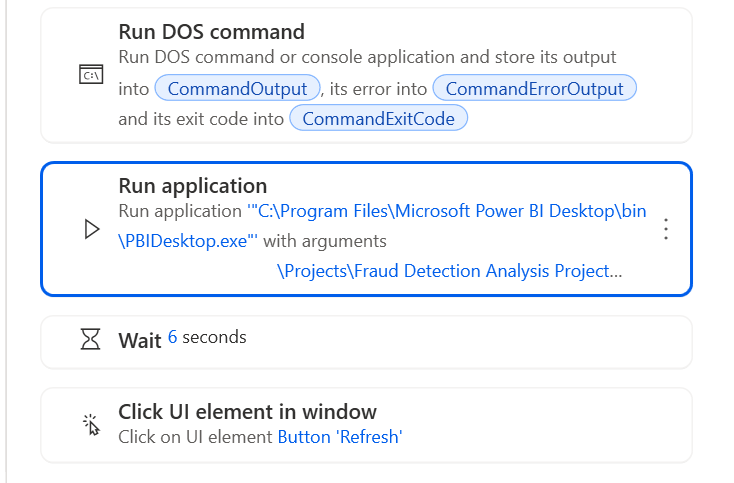

## <p style="text-align: center;">Fraud Detector and Analysis  🚩</p>
In 2024, the Federal Trade Commission recorded $12.5 billion lost to just fraud alone which is a 25% increase from the previous year. However, the number of fraud reports remained relatively stable, meaning that people are losing more money to fraud than ever before. This project leverages Reddits continuous stream of information about scams and fraud to identify the latest threats and analyze information with automated workflows. 


<br>

###   &nbsp; Project overview 
--- 
This small project uses Python to call Reddit's API and gather fraud/scam-related discussions from customizable subreddits. The data is cleaned and processed using natural language processing and then automatically refreshed in a premade Power BI dashboard using Power Automate.

###   &nbsp;

<br>

### Project Components 
- #### **[Main.py](https://github.com/gokul2178/fraud-detection-analysis/blob/main/Main.py)**
    - The script authenticates with `generateToken()` and collects threads from Reddit using a customizable function: <br>
    ```risingPosts(subreddit = "Scams", numPosts = 15, numComments = 4)``` <br>
    - Stores the data as a CSV after processing where it can be used to refresh old data in Power BI


- #### **[Data_Collection.py](https://github.com/gokul2178/fraud-detection-analysis/blob/main/Data_Collection.py)**
    - **Functions**: <br>
        - `generateToken()`: Obtains an OAuth token for Reddit API authentication. <br> 
        - `risingPosts()`: Fetches posts from a specified subreddit and gathers comments. <br>
        - `getComments()`: Retrieves comments for individual posts. <br>
        - `savefile()`: Saves the collected data into JSON files. <br>


- #### **[Data_Modification.py](https://github.com/gokul2178/fraud-detection-analysis/blob/main/Data_Modification.py)**
    - **Functions**: <br>
        - `convertCSV()`: Converts the raw JSON files to CSV format and formats nested JSON objects. <br>
        - `cleanData()`: Cleans and processes the raw data by removing irrelevant content, normalizing text, and applying natural language 
&nbsp;&nbsp;&nbsp;&nbsp;&nbsp;&nbsp;&nbsp;&nbsp;processing techniques like tokenization, lemmatization, and stopword removal. <br>
        - `createRiskInfo()`: Analyzes the cleaned text for keywords related to scams and fraud, creates a new column to display associated     
&nbsp;&nbsp;&nbsp;&nbsp;&nbsp;&nbsp;&nbsp;&nbsp;keywords and another column to show the threat level based on keywords detected <br>

<br>


### Automation  
Power Automate is a Microsoft tool that enables the automation of workflows across multiple applications and services without complex code. It allows users to set up automatic triggers and actions to efficiently finish tasks.

This project uses Power Automate to automatically run the script and refresh a Power BI dashboard with the latest fraud data processed from Reddit. 



<br>

### Usage 
--- 
If you want to try the project for some reason just fill in the [.env](https://github.com/gokul2178/fraud-detection-analysis/blob/main/.env) file with your reddit applications information. You can make an app [here](https://www.reddit.com/prefs/apps).

